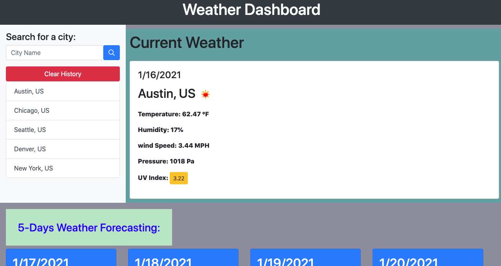
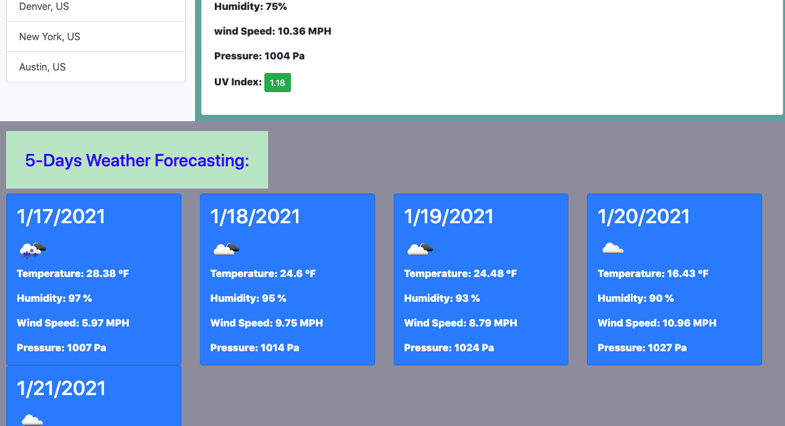
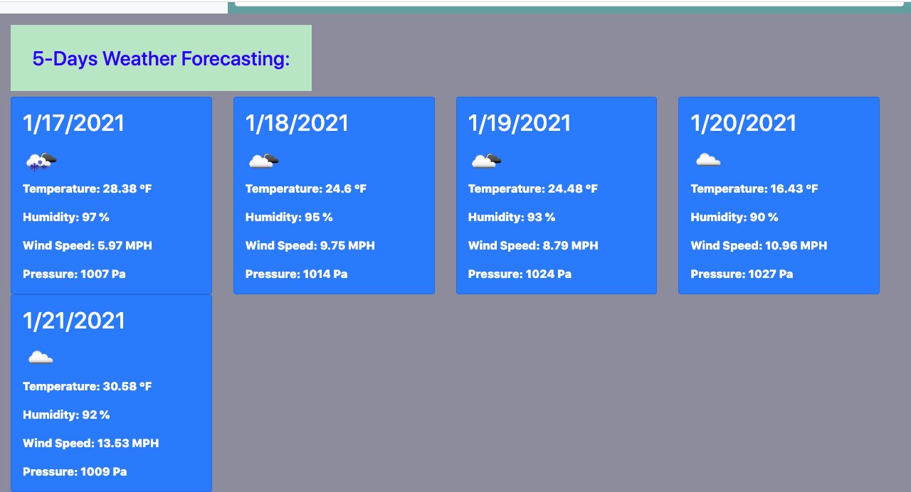

# weather_dashbord

I made this appilication to show for 5-Days Weather forecasting.It includes Index.html,script.js, sytle.css and Screenshot image dayly weather results and it shows 5 days weather city results sample.
in my index.html includes fontawesome ,bootstrap cdn and my style.css to style the page.
There is searchbutton for city  when you click the button there is display list and the results weather shows current date name of the city, country, temperature, humidity, WindSpeed, pressure,latitude and longitude or UV index at forecasting.
At dayly weather forecasting we can find iamge,date, name of the City, Country,Temperature, Humidity, Wind speed alititued, longutud and pressure is listed. In the 5-Days weather forecasting the app includes date,image, temperature, humidity, Wind Speed and pressure with their units.
The app also set evey searched city in localstorage customer can get the weather easily from localstorage.

URL:  https://destish21.github.io/weather_dashbord/