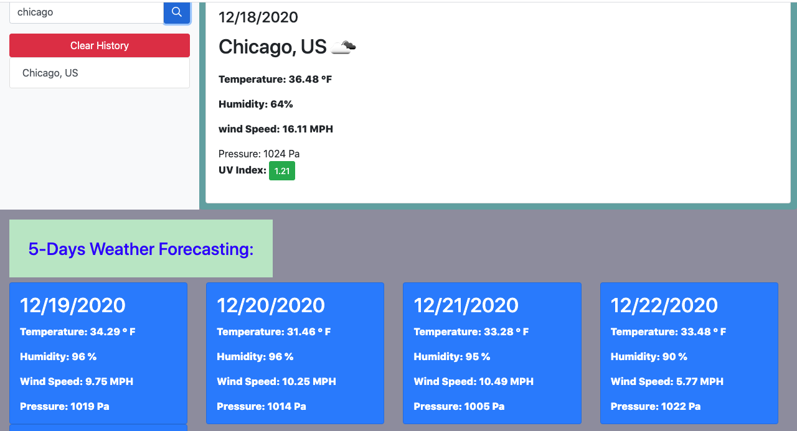

# weather_dashbord

I made this appilication to show for 5-Days Weather forecasting.It includes Index.html,script.js, sytle.css and Screenshot image it shows 5 city results sample.
in my index.html fontawesome ,bootstrap cdn and my style.css to style the page.
There is searchbutton for city or country when you click the button there unoder list display and the results of weather date name of the city, country, temp,humidity,pressure at forecasting.
At dayly weather forecasting we can find iamge,date, name of the City, Country,Temp, Humdity, Wind speed alititued, longutud and pressure is listed.

URL:  https://destish21.github.io/weather_dashbord/